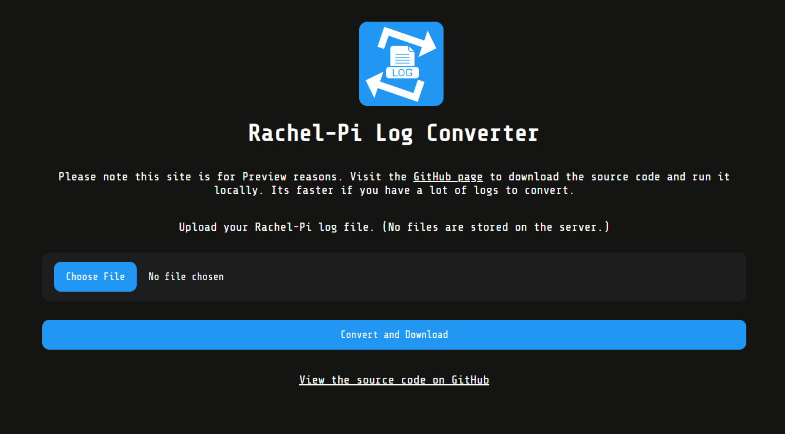
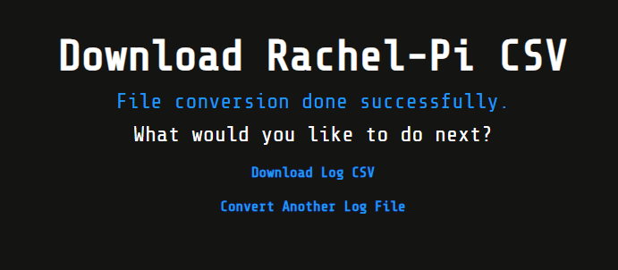

<p align="center">
<a href="https://rachel-pi-log-converter.azurewebsites.net/">
</a>
</p>
<h1 align="center">Rachel-Pi Log Converter</h1>

<!-- Badges -->
<p align="center">


</p>


<div align="center">
  <a href="https://rachel-pi-log-converter.azurewebsites.net/">Preview</a>
  <span>&nbsp;&nbsp;•&nbsp;&nbsp;</span>
  <a href="./CODE_OF_CONDUCT.md">Contribution</a>
  <span>&nbsp;&nbsp;•&nbsp;&nbsp;</span>
  <a href="./LICENSE.md">License</a>
  <span>&nbsp;&nbsp;•&nbsp;&nbsp;</span>
  <a href="#donations">Donation</a>
  <br />
</div>

## What is Rachel-Pi Log Converter?
> **​​Rachel-Pi Log Converter is still under development** All help that you could give would be greatly appreciated. Please see the [Contributing](#contributing) section for more information. Also, the preview website is run at my own cost so any donations would be greatly appreciated. Please see the [Donations](#donations) section for more information.

Rachel-Pi Log Converter is a web application that allows you to convert the logs from the [Rachel-Pi](https://worldpossible.org/rachel-pi/) into a more readable format. The logs are converted into a CSV file that can be viewed in any Spreadsheet application.

This format makes it easy for anyone to view the logs and create reports on the usage of the Rachel-Pi.

## Installation
The preview site is quite slow when you have a lot of log files you need to process so I would advice you run the application locally, this would greatly increase the speed at which you work.

### Prerequisites
- Python 3.6 or higher
- Pip

### Installing
1. Clone the repository
```
git clone https://github.com/Llewellyn500/RACHEL-Pi-log-file-converter.git
```
```
cd RACHEL-Pi-log-file-converter
```
2. Install the required packages
```
pip install -r requirements.txt
```
3. Run the application
```
python app.py
```
4. Open the application in your browser
```http://localhost:5000```

<p align="center">

</p>

## Usage
1. Select the log files you want to convert

<p align="center">

</p>

2. Click the "Convert and Download" button

<p align="center">

</p>

3. Wait for the conversion to finish
4. Click the "Download" button to download the converted file
<p align="center">

</p>

## Contributing

Refer to the [CODE_OF_CONDUCT.md](./CODE_OF_CONDUCT.md) guide to start contributing to Rachel-Pi Log Converter.

## License

Refer to the [License.md](./LICENSE.md) page for information about licensing.

## Donations
Refer to the [Donations.md](#) page for information about donations.